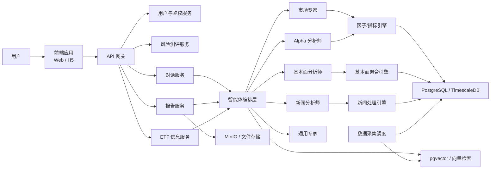
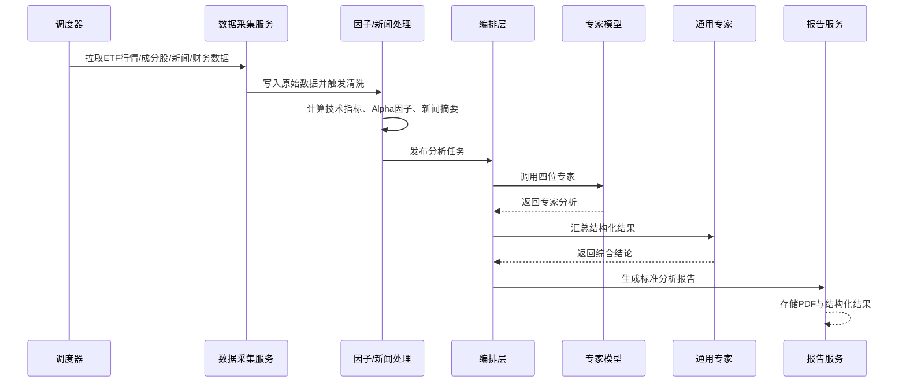

# A股ETF智能投顾系统设计

## 1. 项目目标

基于《A股ETF投顾系统方案》，建设一个面向 A 股 ETF 投资场景的智能投顾系统。系统需要同时满足以下目标：

- 为用户提供 ETF 单品分析、投资建议、风险预警与多轮问答服务。
- 通过多专家模型协同完成“量价分析 + 新闻分析 + Alpha 分析 + 基本面分析 + 通用整合分析”。
- 根据用户问卷结果输出风险承受能力评分、投资偏好标签及建议适配度。
- 所有分析结果必须可追溯到数据来源，避免无依据生成。
- 提供可下载的分析报告与友好的前端交互界面，界面风格采用“二次元小猫投顾助手”主题。

## 2. 需求拆解

### 2.1 核心功能

1. 风险测评
2. ETF 选择与检索
3. 单只 ETF 分析报告生成
4. 多轮智能问答
5. 投资建议与风险预警
6. 报告下载与历史记录查询
7. 数据源管理与来源追溯
8. 专家模型协同编排

### 2.2 用户场景

#### 场景一：首次进入系统

用户完成风险评估问卷，系统输出：

- 风险等级：保守型 / 稳健型 / 平衡型 / 积极型 / 激进型
- 投资偏好：宽基 / 行业 / 红利 / 主题 / 商品 / 跨境
- 投资期限：短期 / 中期 / 长期
- 可接受回撤区间

#### 场景二：查看某只 ETF

用户输入 ETF 代码或名称，例如 `510300`、`159915`，系统返回：

- ETF 基础信息
- 近 20 / 60 / 120 个交易日走势与成交特征
- 相关新闻与热点事件
- Alpha 因子评分与同类对比
- 成分股基本面摘要
- 综合结论、风险点与未来数日建议

#### 场景三：继续追问

用户围绕某只 ETF 多轮发问，例如：

- 现在适合加仓吗
- 和沪深 300 ETF 相比哪个更稳
- 如果我只能持有两周，风险大吗

系统在保留上下文与用户风险画像的前提下持续回答，并引用最近分析结果和原始数据来源。

## 3. 整体架构



## 4. 分层设计

### 4.1 前端层

推荐技术栈：

- `Vue 3 + Vite + TypeScript`
- `Pinia`
- `Naive UI` 或 `Ant Design Vue`
- `ECharts` 用于 K 线、成交量、因子雷达图、风险仪表盘

前端页面建议：

- 首页：小猫投顾助手、系统简介、今日重点 ETF
- 风险测评页：问卷、评分、风险画像
- ETF 详情页：行情、新闻、因子、成分股、综合观点
- 智能问答页：多专家对话、来源引用、建议卡片
- 报告中心：历史报告列表、下载 PDF
- 用户中心：风险档案、关注 ETF、消息提醒

UI 风格建议：

- 角色化呈现五位专家小猫形象，每位专家使用固定色系和头像
- 市场专家：蓝色
- 新闻分析师：橙色
- Alpha 分析师：青绿色
- 基本面分析师：棕金色
- 通用专家：红色

### 4.2 接入层

API 网关负责：

- JWT 鉴权
- 统一限流
- 请求日志
- 会话路由
- 灰度开关

### 4.3 业务服务层

建议拆分为以下服务：

1. `user-service`
   - 用户信息
   - 风险档案
   - 偏好标签

2. `etf-service`
   - ETF 基础资料
   - 行情聚合
   - 成分股信息
   - 分类标签

3. `risk-service`
   - 问卷题库
   - 评分模型
   - 风险等级映射
   - 投资偏好标签生成

4. `advisor-service`
   - 多专家编排
   - 结论整合
   - 投资建议生成
   - 风险预警生成

5. `chat-service`
   - 多轮对话
   - 上下文管理
   - Prompt 模板管理
   - 来源引用拼装

6. `report-service`
   - 分析报告排版
   - HTML/PDF 导出
   - 报告归档

7. `data-service`
   - 行情采集
   - 新闻抓取
   - 财务数据同步
   - 因子计算任务

### 4.4 智能体编排层

原方案提到 `openclaw`。工程实现上建议采用“可替换编排层”：

- 如果团队已有 `openclaw` 使用经验，则将其作为 agent workflow runtime。
- 如果需要更稳定的工程支持，优先落地为 `LangGraph` 或自研 DAG 编排器。

编排层职责：

- 根据用户请求决定调用哪些专家
- 拉取对应数据上下文
- 为每个专家构建结构化输入
- 收集各专家输出
- 交给通用专家完成最终整合
- 做来源校验与格式化输出

## 5. 多专家模型设计

### 5.1 市场专家模型

输入数据：

- ETF 日频 OHLCV
- 成交额、换手率、振幅
- 均线、MACD、RSI、布林带等技术指标
- 北向资金、市场情绪指标
- 近 20 / 60 / 120 个交易日表现

输出内容：

- 趋势判断：上升 / 震荡 / 下行
- 强弱判断：相对大盘、相对同类 ETF
- 短期交易拥挤度
- 未来 3 至 5 个交易日概率性判断
- 风险提示：放量下跌、趋势破位、追高风险

### 5.2 新闻分析师模型

输入数据：

- ETF 相关关键词新闻
- 成分股相关新闻
- 宏观政策新闻
- 行业主题新闻

处理流程：

1. 新闻抓取与去重
2. 事件抽取
3. 情绪分析
4. 影响期限判断
5. 与 ETF/行业映射

输出内容：

- 最近重要事件摘要
- 情绪倾向：利多 / 中性 / 利空
- 影响链条说明
- 短中期影响判断
- 低置信度新闻过滤说明

### 5.3 Alpha 分析师模型

输入数据：

- 已构建 alpha 因子库
- ETF 历史收益率
- 行业暴露、风格暴露
- 跟踪误差、流动性、波动率

建议因子维度：

- 动量因子
- 波动率因子
- 量价协同因子
- 资金流因子
- 估值映射因子
- 行业轮动因子

输出内容：

- 因子得分总览
- 同类 ETF 排名
- 优势因子与拖累因子
- 因子拥挤度风险
- 未来数日风格适配性

### 5.4 基本面分析师模型

输入数据：

- ETF 成分股及权重
- 成分股财务指标
- 行业分布
- 盈利能力、估值、成长性指标

处理逻辑：

- 对成分股按权重聚合基本面指标
- 计算组合层面的 PE、PB、ROE、营收增速、利润增速
- 分析成分行业景气度与集中度

输出内容：

- ETF 底层资产质量
- 估值是否偏贵或偏低
- 行业集中风险
- 基本面驱动因素

### 5.5 通用专家模型

职责：

- 汇总四位专家观点
- 结合用户风险画像与投资期限
- 输出最终建议
- 识别专家间冲突并进行解释

输出模板建议：

1. ETF 核心结论
2. 四位专家观点摘要
3. 一致性与分歧点
4. 对未来 3 至 5 个交易日的判断
5. 适合何类用户
6. 操作建议：关注 / 分批建仓 / 持有 / 观望 / 减仓
7. 风险提示与触发条件

## 6. 数据架构设计

### 6.1 数据源

推荐优先级：

1. `AKShare`
2. `TuShare`
3. 交易所与基金公司公开数据
4. 东方财富、财联社、证券时报等财经资讯源

### 6.2 数据分类

- 基础主数据：ETF 基本信息、基金公司、指数信息
- 行情数据：日线、分钟线、成交额、换手率
- 成分股数据：持仓、权重、行业分类
- 基本面数据：财务报表、估值指标
- 新闻数据：标题、正文、来源、发布时间、标签
- 因子数据：单因子值、标准化结果、综合评分
- 用户数据：问卷结果、会话记录、关注列表、下载记录

### 6.3 存储方案

- `PostgreSQL`：业务主库
- `TimescaleDB`：时序行情与因子序列
- `Redis`：会话缓存、热点 ETF 缓存、任务状态缓存
- `pgvector`：新闻摘要、报告片段、历史问答向量检索
- `MinIO`：PDF 报告、导出文件

### 6.4 核心表设计

建议核心表：

- `users`
- `user_risk_profiles`
- `risk_questionnaires`
- `risk_answers`
- `etf_master`
- `etf_quotes_daily`
- `etf_constituents`
- `stock_fundamentals`
- `etf_alpha_factors`
- `news_articles`
- `news_etf_mapping`
- `analysis_tasks`
- `expert_outputs`
- `advisor_reports`
- `chat_sessions`
- `chat_messages`
- `alert_rules`
- `alert_events`

## 7. 关键流程设计

### 7.1 每日离线分析流程



### 7.2 用户实时问答流程

1. 用户进入 ETF 对话页并选择目标 ETF。
2. 系统读取用户风险档案和最近分析结果。
3. 对话服务判断问题类型：
   - 基础问答
   - 深度分析
   - 对比问答
   - 风险预警
4. 编排层按需调用单个专家或完整专家链。
5. 通用专家整合结果，附上数据来源和时间戳。
6. 返回可解释回答，并支持继续追问。

### 7.3 风险测评流程

1. 用户完成问卷。
2. 系统根据年龄、收入、投资经验、回撤承受能力、流动性需求等维度评分。
3. 生成风险承受等级和偏好标签。
4. 后续建议生成时作为强约束条件参与 Prompt 与规则引擎计算。

## 8. 建议的“模型 + 规则”双引擎机制

为了满足“严谨、不可胡编乱造”，建议不要只依赖大模型，而是采用双引擎：

### 8.1 规则引擎负责

- 风险等级硬约束
- 不可推荐超出用户承受能力的策略
- 高频交易、杠杆、追涨杀跌等敏感建议过滤
- 缺失数据时中止分析或降级回答
- 数据时间戳校验

### 8.2 大模型负责

- 自然语言分析
- 多专家观点组织
- 新闻摘要与解释
- 用户对话理解
- 报告表达与个性化呈现

### 8.3 输出约束

统一要求所有模型输出 JSON，再由服务端渲染为自然语言和报告，避免不可控文本格式。建议字段如下：

```json
{
  "summary": "结论摘要",
  "signals": ["信号1", "信号2"],
  "risks": ["风险1", "风险2"],
  "suggestion": "观望",
  "confidence": 0.74,
  "sources": [
    {
      "type": "market_data",
      "name": "AKShare",
      "as_of": "2026-04-04"
    }
  ]
}
```

## 9. API 设计建议

### 9.1 用户与风险测评

- `POST /api/v1/risk/questionnaire/submit`
- `GET /api/v1/risk/profile`

### 9.2 ETF 查询

- `GET /api/v1/etfs/search?q=`
- `GET /api/v1/etfs/{code}`
- `GET /api/v1/etfs/{code}/quotes`
- `GET /api/v1/etfs/{code}/factors`
- `GET /api/v1/etfs/{code}/news`

### 9.3 分析与报告

- `POST /api/v1/analysis/tasks`
- `GET /api/v1/analysis/tasks/{task_id}`
- `GET /api/v1/reports/{report_id}`
- `GET /api/v1/reports/{report_id}/download`

### 9.4 智能问答

- `POST /api/v1/chat/sessions`
- `POST /api/v1/chat/sessions/{session_id}/messages`
- `GET /api/v1/chat/sessions/{session_id}/messages`

### 9.5 预警

- `POST /api/v1/alerts/rules`
- `GET /api/v1/alerts/events`

## 10. 推荐技术选型

### 10.1 后端

- `FastAPI`：接口服务
- `SQLAlchemy + Alembic`：数据访问与迁移
- `Celery / Dramatiq`：异步任务
- `Redis`：缓存与消息中间件
- `PostgreSQL + TimescaleDB`：主数据与时序数据

### 10.2 智能体与模型服务

- 编排：`LangGraph` 或 `OpenClaw`
- 模型网关：统一封装本地模型与第三方 API
- 本地部署可选：`vLLM + Llama 系列模型`
- Embedding：新闻、报告、问答片段向量化

### 10.3 前端

- `Vue 3 + TypeScript + Vite`
- `ECharts`
- `UnoCSS` 或 `Tailwind CSS`

### 10.4 运维

- `Docker Compose` 起步
- 中后期升级为 `Kubernetes`
- `Prometheus + Grafana`
- `Loki` 日志采集

## 11. 风控与合规设计

A 股投顾场景中，这部分必须在 MVP 阶段就纳入设计：

- 明确系统定位为“投资辅助分析系统”，不直接提供自动交易执行。
- 每条建议附带免责声明、数据时间、数据来源、适用用户类型。
- 不输出保证收益、保本承诺、确定性涨跌判断。
- 建议内容与用户风险等级强绑定。
- 高风险 ETF、主题 ETF、杠杆/反向产品需单独风险提示。
- 所有报告保留生成快照，便于审计。

## 12. 非功能需求

### 12.1 性能

- ETF 详情页首屏小于 2 秒
- 常规问答响应小于 8 秒
- 深度分析报告生成小于 60 秒

### 12.2 可用性

- 核心服务可用性目标 `99.9%`
- 任务失败支持重试与补偿

### 12.3 可观测性

- 请求链路追踪
- 模型耗时监控
- 数据源同步成功率监控
- 幻觉风险与无来源回答监控

## 13. 推荐 MVP 范围

第一阶段建议不要一开始就做全量能力，优先交付以下闭环：

1. 用户风险问卷与风险画像
2. ETF 基础查询与详情页
3. 市场专家 + 新闻分析师 + 通用专家
4. 单只 ETF 分析报告
5. 基础多轮问答
6. PDF 导出

第二阶段再补充：

- Alpha 因子专家
- 基本面专家
- ETF 对比分析
- 风险预警订阅
- 个性化推荐

第三阶段再扩展：

- 组合建议
- 调仓建议
- 用户画像迭代学习
- 微信/企业微信提醒

## 14. 推荐开发里程碑

### 里程碑一：基础底座

- 完成数据库设计
- 打通 ETF 行情与新闻数据采集
- 完成用户、问卷、ETF 基础接口

### 里程碑二：分析闭环

- 落地市场专家与新闻专家
- 构建通用专家整合逻辑
- 生成首版 ETF 分析报告

### 里程碑三：交互闭环

- 上线多轮问答
- 接入风险画像参与建议生成
- 上线前端核心页面

### 里程碑四：增强能力

- Alpha 因子、基本面专家上线
- 风险预警与订阅系统上线
- 加入监控、审计、灰度能力

## 15. 目录结构建议

```text
ETF投顾系统/
├─ docs/
│  └─ A股ETF智能投顾系统设计.md
├─ apps/
│  ├─ web/
│  └─ api/
├─ services/
│  ├─ advisor-service/
│  ├─ risk-service/
│  ├─ etf-service/
│  ├─ data-service/
│  └─ report-service/
├─ agents/
│  ├─ market-expert/
│  ├─ news-analyst/
│  ├─ alpha-analyst/
│  ├─ fundamental-analyst/
│  └─ general-expert/
├─ packages/
│  ├─ shared-schema/
│  ├─ prompt-templates/
│  └─ ui-kit/
├─ infra/
│  ├─ docker/
│  └─ sql/
└─ scripts/
```

## 16. 结论

这套系统最关键的不是“把多个模型接起来”，而是把以下三件事做好：

1. 数据真实可追溯
2. 模型输出受规则约束
3. 用户建议与风险画像强绑定

如果以这个设计推进，建议采用“先做 ETF 单品分析闭环，再做专家扩展和个性化推荐”的实施路径，这样最容易在 4 到 8 周内做出可信的首个可演示版本。
